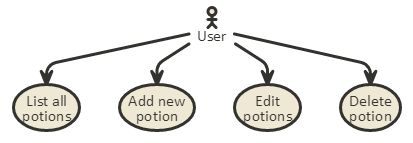

# Receptek2 dokumentáció

Alkalmazások fejlesztése beadandó v 3.0

Készítette: Galambos Krisztina Éva (gaktaai/TYHMTO)

#1. Követelményanalízis

##1.1. Célkitűzés, projektindító dokumentum

A projekt (beadandó) célja egy webes vastagkliens, azaz egyoldalas alkalmazás készízése Ember.js segítségével, szerveroldalon REST API használatával és az adatok perzisztálásával.

Az általam választott téma a "Receptek és hozzávalók" téma átdolgozása bájitalokra. Az elkészítendő alkalmazás alapja egy receptgyűjtő weblap, ahol a látogató beküldhet receptet, majd módosíthatja a recept nevét, leírásást, és a hozzávalóinak listáját. A recepteket meg lehet tekinteni, valamint törölni is lehet őket.

##1.2. Szakterületi fogalomjegyzék

Webes vastagkliens - *egyoldalas webes alkalmazás*

REST API végpont - *...*

##1.3. Használatieset-modell, funkcionális követelmények

Használati esetek:
A felhasználó megtekintheti a már beküldött receptek listáját. Ha az nem üres, akkor már tudja a lista egyes elemeit szerkeszteni és törölni. Új receptet beküldeni bármikor lehet.

Egy kifejtett használati eset folyamatábrája:

Funkcionális követelmények:

1. lehessen beküldeni egy bájital receptet --> recept beküldése,
2. kapjon a felhasználó visszajelzést, hogy a beküldött receptek valóban bekerültek az adatbázisba --> receptek listázása,
3. lehessen egy esetleges hiba észrevételekor javítani a receptet --> receptek szerkesztése
4. lehessen törölni egy receptet,
5. a főoldalon az alkalmazás ismertetése jelenjen meg.

3. Nem funkcionális követelmények:

1. felhasználóbarát, ergonomikus elrendezés és kinézet,
2. gyors működés.

#2. Tervezés

##2.1. Architektúra terv

1. Oldaltérkép
    
    - Home
    - List of Potions
        + Add new potion
		+ View potion
        + Edit potion
        
2. Végpontok

- / : főoldal
- /potions/list : receptlista
- /potions/view/:potin_id : recept adatai
- /potions/edit/:potin_id : recept adatainak módosítása

##2.2. Felhasználóifelület-modell

1. Oldalvázlatok, designtervek

##2.3. Osztálymodell

1. Adatmodell

    

2. Adatbázisterv

    

#3. Implementáció

##3.1. Fejlesztői környezet bemutatása

A program fejlesztése során az alábbi fejlesztői környezeteket, tárolókat használtam:
1. gitHub - itt tárolódik a repository, azaz a gitHub szolgáltatja a tárhelyet az alkalmazásnak
2. cloud9 IDE - itt végeztem az aktuális kódolást, tesztelést az alábbi technológiák használatával: Node.js, Ember.js, fortune.js, neDB Bootstrap CSS, express, routing (middlewares), hbs sablonok, REST API szerver

##3.2. Könyvtárstruktúrában lévő mappák funkciójának bemutatása

Kliensoldalon az "app" mappa tartalmazza a kliensoldalhoz szükséges összes fájlt, valamint tartalmaz több almappát is, amelyek az alábbiak:

1. A "pods/application" mappa tartalmazza az aktuális applikációt.

2. A "pods/components" mappa tartalmazza az Ember.js által generált, majd bővített komponenseket, melyek név szerint vannak almappába rendezve:

2.1. "modal-dialog": a felugróablak (modal),

2.2. "new-potion-form": a felugróablakba betöltendő kérdőív (form),

2.3. "potion-detail": az egyes receptek adatait megjelenítő template,

2.4. "potion-list": a listázóoldal táblázatát tartalmazó template.

3. A "potion" mappa tartalmazza a bájitalok modelljét.

3.1. Az "ingredients" mappa tartalmazza a bájitalokhoz tartozó hozzávalók modelljét.

4. A "potions" mappa tartalmazza a fent felsoroltak controllereit tartalmazó mappákat, név szerint:

4.1. "edit": a szerkesztéshez használt blokk, a "new-potion-form" template-et használja,

4.2. "list": a listázóoldal keretének template-je, a "potion-list" template-et használja, ez a modal miatt egyben használja a "modal-dialog" és a "new-potion-form" template-eket is,

4.3. "view": a "potion-detail" template-et használó controllet mappája.

A "docs" mappa "images" almappája tárolja a jelen dokumentációban szereplő képeket, míg a "dist/assets" mappa a HTML tartalom megjelenítéséhez szükséges bootstrap, bootswatch és js/jquery fájlokat tartalmazza.

Szerveroldalon a ".db" mappa az adatbázis tárolására hivatott, míg a gyökérmappában lévő server.js hivatott az adatbáziskezelés elvégzésére.

#4. Tesztelés

A tesztelés során kézzel teszteltem mindent, mivel kevés funkciója van az elkészített weboldalnak, és nem okozott nagy gondot vagy időkiesést.
Tesztelt esetek:

1. új recept létrehozása

2. recept szerkesztése

3. recept megtekintése (ID-t is mutatja)

4. recept törtlése az adatbázisból.

#5. Felhasználói dokumentáció

A program futtatásához elegendő egy modern böngésző (IE 9+, Google Chrome, Mozilla Firefox, Opera, Safari) és a cloud9 rendszer (node.js).

A program használata egyszerű: a szerver felállása után a kliensoldalon keresztül a felhasználó meglátogatja a főoldalt, ahol rövid leírást olvashat a honlap lényegéről.

Utána a menüben lévő "List of Potions" menüpontra kattintva betöltődik a bájitalreceptek listája. Ha már van recept a táblázatban, akkor a felhasználó továbbra is készíthet új receptet, viszont szerkesztheti, megtekintheti vagy akár törölheti is a már meglévők bármelyikét a táblázat megfelelő sorában a megfelelő gombra kattintva, amelyek sorban az alábbiak:

1. View: recept részleteinek megtekintése

2. Edit: recept szerkesztése

3. Delete: recept törlése.

Ha üres a táblázat, a felhasználó hozzáadhat új receptet, de mást nem tud tenni. Új recept felvételéhez az "Add new potion" feliratú gombra kell kattintania, majd a felugró ablakban kitölteni a megfelelő mezőket, amelyek az alábbiak:

1. Name: a bájital recept neve pl. Polyjuice Potion

2. Effect: a bájital hatása pl. Changes your appearance to look like someone else.

3. Ingredients: a bájital hozzávalói, vesszővel elválasztva pl. Fluxweed, Knotgrass, Lacewing Flies, Leeches

Minden egyes, a felületen végzett változtatás eredménye megjelenik a táblázatban, így a felhasználó valós idejű visszaigazolást kap arról, ami a háttérben az adatbázisban történik.